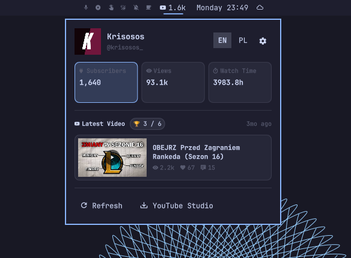
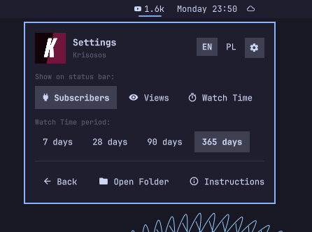

# YouTube Stats for Creators 󰗃

A clean, modern, and private YouTube statistics widget for creators on the [Omarchy](https://omarchy.org/) status bar (Quickshell).

Displays live channel metrics directly on your bar, with a rich dropdown popup for detailed stats, custom metrics, and date range selection.

<p align="center">
  
  &nbsp;
  
</p>

---

## ✨ Features

- **Customizable Bar Preview:** Choose which metric appears on your top bar:
  - 👥 **Subscribers** (e.g., `󰗃 1.6k`)
  - 👁 **Total Views** (e.g., `󰈈 93.1k`)
  - ⏳ **Watch Time** in hours (e.g., `󰔛 3983.8h`)
- **Latest Video Showcase:**
  - Live preview with 16:9 thumbnail, video title, and relative upload date.
  - **YouTube Studio Ranking Badge** (e.g., `🏆 1 / 10` or `🏆 3 / 6`), accurately computed via the YouTube Analytics API comparing normalized performance after publication.
  - Real-time video engagement stats: Views (`󰈈`), Likes (`󰋑`), and Comments (`󰆈`).
  - One-click launch to open and watch the video directly on YouTube.
- **Dedicated Settings View (Gear 󰒓):**
  - Smoothly switch between stats and configuration without extra dialogs.
  - Choose your bar metric, Analytics period (7d / 28d / 90d / 365d), and quick links to open the config folder or documentation.
- **Instant Language Switcher (EN / PL):**
  - Top header toggle to immediately switch between English and Polish.
- **Security & Privacy by Design:**
  - 100% local execution. Zero third-party trackers or external proxy servers.
  - Sensitive tokens are stored in `~/.config/omarchy/youtube-stats/` with strict `0600` permissions.
  - Uses read-only Google OAuth2 scopes (`youtube.readonly`, `yt-analytics.readonly`).

---

## 📦 Installation

Install directly using Omarchy's plugin manager:

```bash
omarchy plugin add https://github.com/krisosos/omarchy-youtube-stats --enable
```

To place the widget in the center next to your clock:

```bash
omarchy bar move krisosos.youtube-stats --before omarchy.clock
```

## 🗑️ Removal

To disable or completely remove the plugin:

```bash
# Disable without uninstalling
omarchy plugin disable krisosos.youtube-stats

# Or uninstall completely
omarchy plugin remove krisosos.youtube-stats
```

Optional: To remove stored OAuth tokens and local cache:
```bash
rm -rf ~/.config/omarchy/youtube-stats
```

---

## 🔑 Setup (Google Cloud Credentials)

Because YouTube considers **Watch Time** private channel data, an OAuth 2.0 Client ID is required to authenticate with the YouTube Analytics API.

### 1. Create Google Cloud Project
1. Go to [Google Cloud Console](https://console.cloud.google.com/).
2. Create a new project (e.g., `Omarchy YouTube Widget`).
3. Under **APIs & Services** > **Library**, enable:
   - **YouTube Data API v3**
   - **YouTube Analytics API**

### 2. Configure OAuth Consent Screen
1. Go to **APIs & Services** > **OAuth consent screen**.
2. Select **External** and fill in your App Name and email.
3. In the **Test users** step, add the Google email address associated with your YouTube channel.

### 3. Generate Credentials
1. Go to **APIs & Services** > **Credentials** > **Create Credentials** > **OAuth client ID**.
2. Choose Application type: **Desktop app**.
3. Download the credentials JSON and save it to:
   ```bash
   mkdir -p ~/.config/omarchy/youtube-stats
   cp ~/Downloads/client_secret_*.json ~/.config/omarchy/youtube-stats/client_secret.json
   chmod 600 ~/.config/omarchy/youtube-stats/client_secret.json
   ```

### 4. Connect Your Account
Click the widget on your Omarchy bar and click **Connect YouTube Account** (or run `python3 ~/.config/omarchy/plugins/krisosos.youtube-stats/scripts/auth.py` in a terminal). A browser window will open asking you to authorize read-only access.

Once complete, your live statistics will automatically load!

---

## 🔒 Security & Privacy

- **No Secrets in Repository:** The plugin repository contains only executable logic. Your `client_secret.json` and OAuth `token.json` live strictly in your local user directory (`~/.config/omarchy/youtube-stats/`), outside git version control.
- **Read-Only Access:** The app only requests `readonly` scopes. It cannot modify your videos, delete comments, or change channel settings.

---

## 📄 License

MIT License © 2026 krisosos
